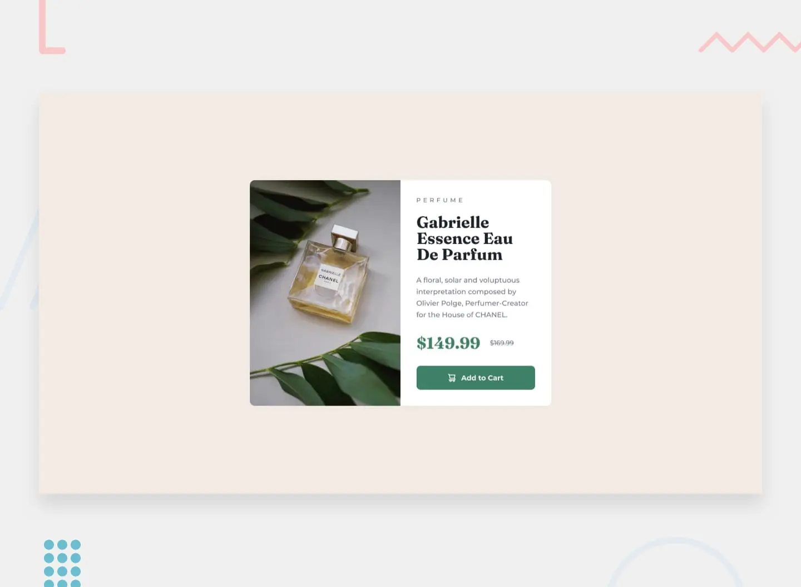

	
	<h1 align="center">Product preview card component solution</h1>
	

		Frontend Mentor Challenge
	

	

		
	

	

		<a href="https://product-preview-card-component-black.vercel.app/">View Demo</a> ･
		<a href="https://www.frontendmentor.io/solutions/product-preview-card-component-solution-D1Njuq38Mb"> View on frontend mentor</a>
	

	

## My process
### Built with
- [Vite](https://vitejs.dev/) - development environment
- [Sass](https://sass-lang.com/) - CSS preprocessor
- [PostCSS](https://postcss.org/) - CSS postprocessor
- [Pug](https://pugjs.org/api/getting-started.html) - HTML preprocessor
- [Eslint](https://eslint.org/) - linter
- [Prettier](https://prettier.io/) - code formatter

### What I learned
- Image compression flow using @squoosh/lib
- CSS Interaction
- BEM, CSS Structuring
- SASS Mixin
- GSAP Animation
- CSS Grid
- Svg icons
- Switch favicon between dark and light modes
- Displaying webfont using webfont loader
- Issue-driven development
