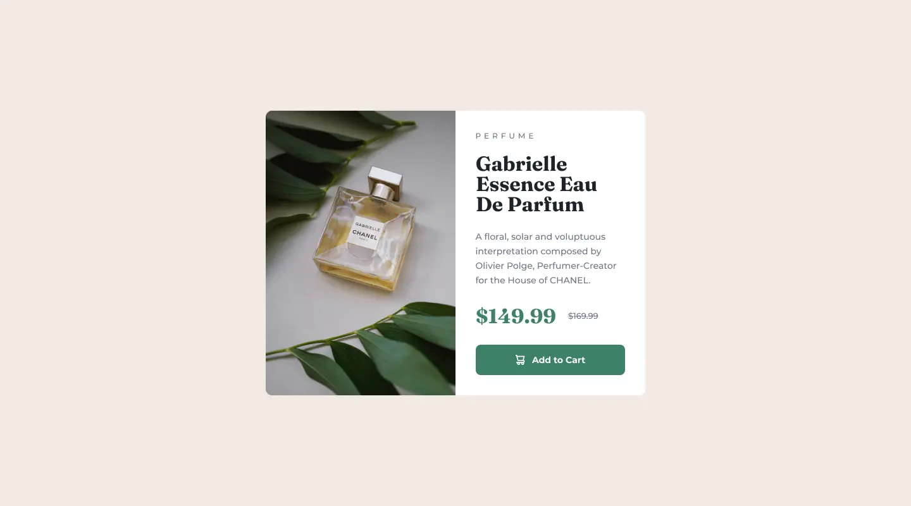

	
	<h1 align="center">Product preview card component solution</h1>
	

		This is a solution to the
		<a href="https://www.frontendmentor.io/challenges/product-preview-card-component-GO7UmttRfa">Product preview card component challenge on Frontend Mentor</a>. 
	

	
<a href="#">View Demo</a>

	

## My process
### Built with
- [Vite](https://vitejs.dev/) - development environment
- [Sass](https://sass-lang.com/) - CSS preprocessor
- [PostCSS](https://postcss.org/) - CSS postprocessor
- [Pug](https://pugjs.org/api/getting-started.html) - HTML preprocessor
- [Eslint](https://eslint.org/) - linter
- [Prettier](https://prettier.io/) - code formatter

### What I learned
- Determine if the browser can use webp and replace the class
- Image compression flow using @squoosh/lib
- CSS Interaction
- GSAP Animation
- CSS Grid
- Svg icons
- Switch favicon between dark and light modes
- Displaying webfont using webfont loader
- Issue-driven development
